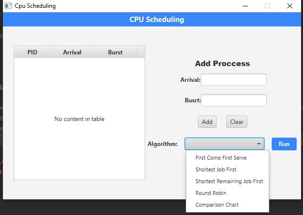
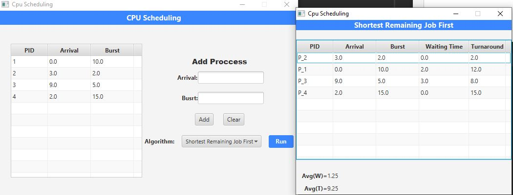
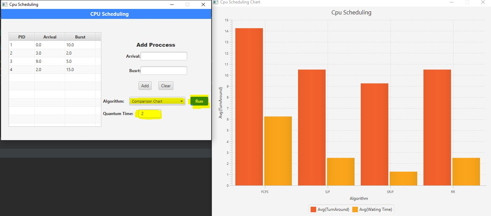

# cpu-scheduling-simulator
cpu scheduling algorithms simulator for solving cpu scheduling problems and compare between each algorithm through a chart of avg turnaround and avg waiting time for each algorithm

## Usage
- add all processes through add process area in the home view by adding its arrival time and burst time
- clear button used to clear all inserted processes
- after inserting all processes to run any algorithm
    1. select the algorithm (note : for a round-robin you need to insert the quantum time)
    2. click run button or press enter after entering burst time
